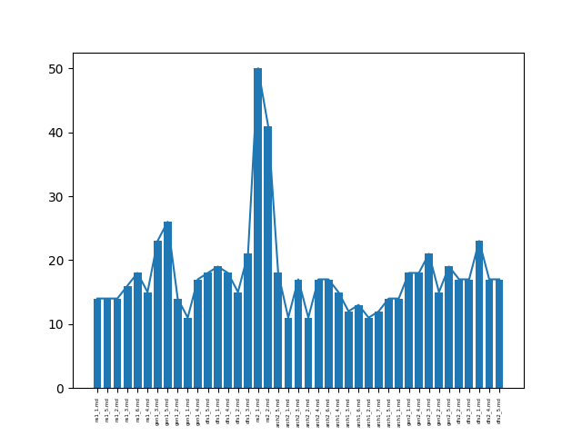

# ThemaGen - ThemaGenerator

## Διαδικασία
* Δημιουργία ενός αρχείου με usernames φοιτητών (users.txt)


### Δημιουργία θεμάτων

*  Καθορισμός καταλόγων κάτω από τον κατάλογο questions με τις κατηγορίες των θεμάτων, δώστε ένα κωδικό όνομα για κάθε κατηγορία, π.χ. ``arch``
* Σε κάθε κατηγορία δημιουργήστε με το ίδιο όνομα και κατάληξη ``<όνομα_κατηγορίας>_<Αύξων-αριθμός>.md``, π.χ. ``arch_1.md, arch_2.md`` κτλ
* Για κάθε κατηγορία σημειώστε το πλήθος των ερωτήσεων που θέλετε να επιλεχθούν
* Αντιγράψτε το αρχείο config.yaml.example και ορίστε εκεί τις παραμέτρους που αφορούν τις κατηγορίες, τις ερωτήσεις σε κάθε κατηγορία και το πόσες επιλογές θα γίνουν από αυτές τις ερωτήσεις
Παράδειγμα:
```yaml
# categories
categories:
  history:
    size: 5
    select: 2
  maths:
    size: 5
    select: 2
```

Στη συνέχεια δημιουργήστε ένα αρχείο που να περιέχει τα usernames των χρηστών ανά γραμμή, π.χ. ``users.txt`` και δείτε το με την εντολή
```bash
cat users.txt| tr '\n' ' '
```
* Για να δημιουργήσουμε τα θέματα, εκτελούμε το 
```bash
python make_tests.py $(cat users.txt| tr '\n' ' ')
```
Στον κατάλογο files δημιουργήθηκαν τα θέματα σε md. Τα μετατρέπουμε σε pdf με
```bash
./generate_pdf.sh
```
αφού βεβαωθούμε ότι έχουμε τη γραμματοσειρά που αναφέρεται σε αυτό το αρχείο.
* Ρυθμίζουμε τις παραμέτρους mail με τις παραμέτρους σύνδεσης στον mail server και τις παραμέτρους messages για το κείμενο που θα σταλεί με email
Τα στέλνουμε με email με
```bash
./send_emails.sh
```
Το συγκεκριμένο script ψάχνει τον κατάλογο images και για όσα pdf βρει, σχηματίζει το email με βάση το όνομα του pdf αρχείου και την κατάληξη "@domain.com" και τα στέλνει.
* αν θέλετε μπορείτε να τρέξετε την εντολή
```bash
python3 plot.py logs/<logfilename>
```
και να έχετε στον κατάλογο samples την κατανομή των θεμάτων.

Προαπαιτούμενα:

* python3
* bash
* pandoc

Python libraries:

* matplotlib

## Δείγματα

[Δείγμα θεμάτων](./samples/tsadimas.pdf) σε pdf μορφή
### Κατανομή θεμάτων
