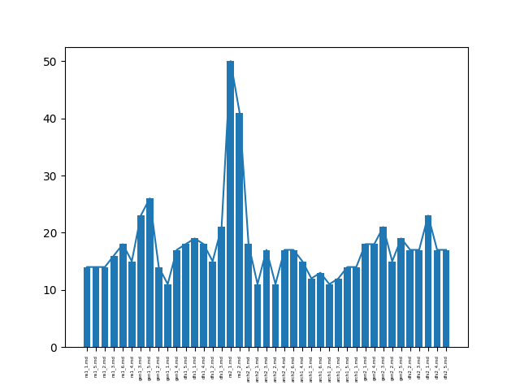

# ThemaGen - ThemaGenerator


## Παραδοχές

1. Έχετε θέματα οργανωμένα σε κατηγορίες, στις οποίες μπορείτε να ορίσετε πόσες επιλογές θέλετε από κάθε μια κατηγορία, ώστε να επιλεχθούν τυχαία τόσες ερωτήσεις από κάθε θέμα
2. Τα θέματά σας μπορείτε να τα μετατρέψετε εύκολα σε markdown μορφή σύμφψνα με το ακόλουθο [link](https://github.com/adam-p/markdown-here/wiki/Markdown-Cheatsheet)
3. Αν θέλετε μπορείτε να συμπεριλάβετε εικόνες στα θέματα (δείτε το παράδειγμα ``assets/questions/maths/maths_4.md``)
4. Μπορείτε να ετοιμάσετε μια εικόνα όπως η ``assets/files/images/ds_-2-20-logo.png`` που να περιλαμβάνει το logo και το όνομα του μαθήματός σας και να ρυθμίσετε το αρχείο ``themagen/tests.py`` στη μέθοδο ``_generate_file()`` ώστε να το συμνπεριλάβει στην αρχή του αρχείου. Δείτε το [δείγμα θεμάτων](./assets/samples/tsadimas.pdf).
5. Τα θέματα παράγονται σε pdf μορφή με τη βοήθεια του προγράμματος [pandoc](https://pandoc.org/). Μπορείτε να ρυθμίσετε το font στο αρχείο ``themagen/pdf.py`` αρκεί να διαθέτετε το font στον υπολογιστή σας.
6. Τα θέματά σας θα δημιουργηθούν στον κατάλογο ``assets/files`` και δεν θα ανέβουν στο git repo λόγω του ``.gitignore``


## Διαδικασία
* Δημιουργία ενός αρχείου με usernames φοιτητών (users.txt) 
* Αντιγραφή του ``config.yml.example`` σε ``config.yml`` 
```bash
cp config.yml.example config.yml
```
και παραμετροποίησή του σύμφωνα με τις ανάγκες σας. Το αρχέιο ``config.yml`` δεν ανεβαίνει στο git repo.

### Δημιουργία θεμάτων

*  Καθορισμός καταλόγων κάτω από τον κατάλογο questions με τις κατηγορίες των θεμάτων, δώστε ένα κωδικό όνομα για κάθε κατηγορία, π.χ. ``arch``
* Σε κάθε κατηγορία δημιουργήστε με το ίδιο όνομα και κατάληξη ``<όνομα_κατηγορίας>_<Αύξων-αριθμός>.md``, π.χ. ``arch_1.md, arch_2.md`` κτλ
* Για κάθε κατηγορία σημειώστε το πλήθος των ερωτήσεων που θέλετε να επιλεχθούν
* Αντιγράψτε το αρχείο config.yaml.example και ορίστε εκεί τις παραμέτρους που αφορούν τις κατηγορίες, τις ερωτήσεις σε κάθε κατηγορία και το πόσες επιλογές θα γίνουν από αυτές τις ερωτήσεις
Παράδειγμα:
```yaml
# categories
categories:
  history:
    size: 5
    select: 2
  maths:
    size: 5
    select: 2
```

Στη συνέχεια δημιουργήστε ένα CSV αρχείο που να περιέχει τα usernames των χρηστών ανά γραμμή, π.χ. ``users.csv``, μπορείτε να δείτε ένα παράδειγμα με την εντολή
```bash
cat users.csv.example
```

* Για να δημιουργήσουμε τα θέματα, εκτελούμε το 
```bash
python3 main.py gentests
```

Στον κατάλογο files δημιουργήθηκαν τα θέματα σε md. Τα μετατρέπουμε σε pdf με
```bash
python3 main.py genpdf
```
αφού βεβαωθούμε ότι έχουμε τη γραμματοσειρά που αναφέρεται σε αυτό το αρχείο.
* Ρυθμίζουμε τις παραμέτρους mail με τις παραμέτρους σύνδεσης στον mail server και τις παραμέτρους messages για το κείμενο που θα σταλεί με email
Τα στέλνουμε με email με
```bash
python3 main.py sendmails
```
Το συγκεκριμένο script ψάχνει τον κατάλογο images και για όσα pdf βρει, σχηματίζει το email με βάση το όνομα του pdf αρχείου και την κατάληξη "@domain.com" και τα στέλνει.
* αν θέλετε μπορείτε να τρέξετε την εντολή
```bash
python3 main.py plot <logfilename>
```
και να έχετε στον κατάλογο assets/samples την κατανομή των θεμάτων.

Προαπαιτούμενα:

* python3
* bash
* pandoc
* xelatex
* NotoSans Nerd Font

Python libraries:

* matplotlib

## Δείγματα

[Δείγμα θεμάτων](.assets//samples/tsadimas.pdf) σε pdf μορφή
### Κατανομή θεμάτων
